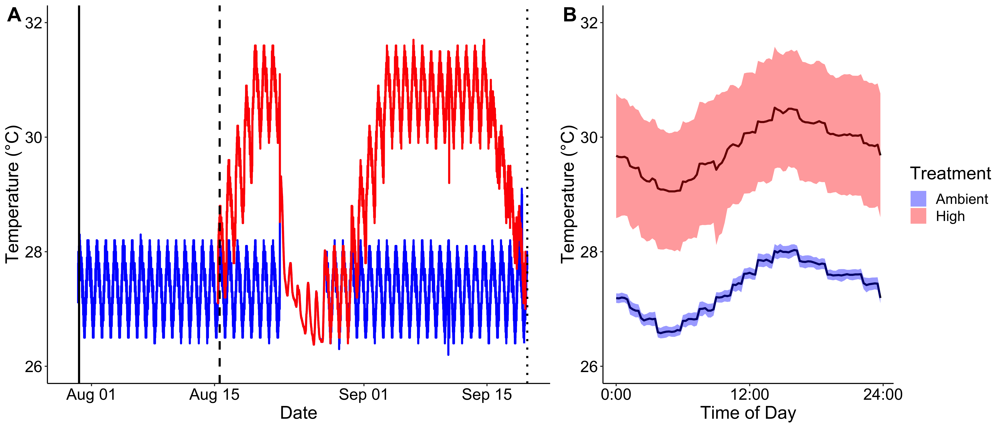

# **Experimental Design**   

Survival of juvenile corals is vital for the recovery and resilience of reefs as global climate change and local stressors threaten the persistence of these ecosystems. However, newly settled coral recruits are at high risk for mortality due to their small size. Tissue fusion with neighboring recruits provides a pathway to rapidly increasing total colony size faster than would be achieved by growth alone. As self-recognition systems do not fully develop until several months post-settlement, fusion between newly settled juvenile colonies provides an opportunity for an increase in genetic diversity along with an increase in size. Although fusion provides advantages for survival across several species, it is unknown whether an increase in size or genetic diversity drives increases in survival. As ocean temperatures continue to increase, these potential benefits of fusion may provide ecological advantages during thermal stress events. In this study, We test these concepts by investigating the implications of fusion between newly settled *Pocillopora acuta* juveniles. We manipulated the genotypic richness and number of juveniles involved in tissue fusion to analyze influences on survival and growth in thermal stress. In ambient conditions, tissue fusion provided a significant survival advantage regardless of genotypic diversity, while negative competitive effects existed between closely settled, but non-fused, juveniles. In the presence of thermal stress, tissue fusion significantly delayed juvenile mortality and fusion between multiple genotypes provided an additional survival advantage. Delayed mortality as a result by tissue fusion and elevated genotypic diversity provides a window of opportunity for increased survival of fused juveniles. These results indicate that tissue fusion provides important ecological advantages in thermal stress for *P. acuta*, which are further enhanced by increased genetic diversity. Further research is required to determine energetic and genetic mechanisms that contribute to increases in survivorship as a result of tissue fusion.  

*Please see manuscript for detailed methodology*  

In this experiment, settled juvenile corals were secured on slides either as solitary individuals or in groups. Groups were composed of 2, 3, or 4 juveniles either from the same genotype or of multiple genotypes. See genetic analyzes for distinction of genotypes. These slides were then placed in an indoor tank system with light and flow-through seawater at ambient temperature for a period of 15 days, allowing them to grow and have the opportunity to fuse. This period is referred to as the "grow out period". At the end of the grow-out period, we measured survivorship (alive or dead), growth (as number of polyps per juvenile), and fusion rate (fusion success or no fusion). Fusion was identified by continuous pigmentation across boundaries between juveniles with clear tissue connectivitiy. We then analyze the effect of genotypic richness and fusion on survival and growth. All responses in this experiment were measured at the level of the individual juvenile, not at the level of the slide community.

After the 15-day grow-out period, we exposed juveniles on slides to either a continuation of the ambient treatment (daily maximum temperature = 27.4 °C) or exposure to a high temperature (daily maximum temperature = 30.8 °C). At multiple points during this "stress period", we measured survivorship (alive or dead), growth (numer of polyps per juvenile), and fusion persistence (fusion success or no fusion). We analyzed the effect of temperature, fusion (classified as the fusion status at the start of the stress period), and genotypic richness on survivorship and growth. Additionally, we analyzed the effect of temperature and genotypic richness on fusion persistence. 

 


 


# **Data Analysis**     
## **Analysis Setup**   
  
Set up workspace, set options, and load required packages. 
```{r, echo=TRUE, show=FALSE, warning=FALSE, message=FALSE}
rm(list=ls(all=TRUE)) 
```

```{r, echo=TRUE, warning=FALSE, message=FALSE}
library(gridExtra)
library(multcomp)
library(emmeans)
library(ggplot2)
library(dplyr)
library(effects)
library(plyr)
library(lattice)
library(glmmTMB)
library(effects)
library(lsmeans)
library(MuMIn)
library(MASS)
library(car)
library(FSA)
library(lmerTest)
library(lme4)
library(blmeco)
library(ggsci)
library(coxme)
library(survival)
library(cowplot)
library(RColorBrewer)
library(tidyverse)
library(partitionBEFsp)
library(factoextra)
library(ggfortify)
library(cowplot)
library(survminer)
```

## **1. Grow-Out Period: Survivorship**  
### **Load data**     

Survivorship is measured as binary (alive = 1, dead = 0) on each individual spat in the experiment.     

```{r, results=TRUE, warning=FALSE, message=FALSE}
#load data
rearing<-read.csv("Data/GrowOut_Responses_PostGenotyping.csv", header=TRUE, sep=",", na.strings="NA") #load data
rearing$Quadrant<-as.factor(rearing$Quadrant) #change to factors
rearing$Diversity.Type<-relevel(rearing$Diversity.Type, ref="Individual")
rearing$Community<-relevel(rearing$Community, ref="Individual")
```

Subset the final timepoint for additional analyses.   
```{r, results=TRUE}
final<-rearing[which(rearing$Timepoint == "Final"),] #subset final timepoint
group<-rearing[which(rearing$Community == "Group"),] #subset juveniles in "groups"
group_final<-group[which(group$Timepoint == "Final"),] #subset the final timepoint for groups
```

### **Analysis**  

Analyze survival at the end (final timepoint) of the grow-out period with a logistic binomial regression model.  

Main effects: Genotypic richness, community size (either individual juveniles or groups of juveniles), fusion partners (the number of juveniles each juvenile was fused with), and the interaction of genotypic richness and fusion.  

Random effects: Parent colony nested within parent colony collection reef, tank, and slide.  
 
Here, generate the summary of the model and the anova table output for use of p-values.  

```{r, results=TRUE, warning=FALSE, message=FALSE}
#with final dataset
survmod2<-glmer(Survivorship ~ Richness + Community + Fusion.Partners + Richness:Fusion.Partners + (1|Parent.Site/Colony) + (1|Tank) + (1|Slide), data=final, family=binomial)
summary(survmod2)
Anova(survmod2)
```

There is a significant difference between individual and groups of juveniles with a significant effect of fusion on survival.  

Display effect estimates for 1) Richness and Fusion Partners; 2) Fusion Partners; 3) Individual vs Groups
```{r, results=TRUE, warning=FALSE, message=FALSE}
#final dataset
summary(effect(c("Richness", "Fusion.Partners"), xlevels=4, survmod2))
summary(effect("Fusion.Partners", xlevels=4, survmod2))
summary(effect("Community", xlevels=4, survmod2))
```


Conduct diagnostics. Passes test for overdispersion (value = 0.9).   
```{r, results=FALSE, warning=FALSE, message=FALSE}
dispersion_glmer(survmod2) #no evidence of overdispersion
plot(residuals(survmod2)) + abline(h=0, lty=2) #Dispersed randomly
```

### **Plotting**  
Create plot for effect of community type (individual juveniles vs. groups of juveniles).   
```{r, results=TRUE, warning=FALSE, message=FALSE}
eff.surv1 <- predictorEffect("Community", survmod2) #set x axis groups
surv.effects1<-plot(eff.surv1,
                   lines=list(multiline=TRUE, #color and type of lines
                              col=c("black"), 
                              lty=1), 
                   confint=list(style="bars", width=4, col="black"), #confidence interval style
                   lwd=4,
                   axes=list(y=list(lim=c(0, 1))),
                   type="response", #scale of response - "response" gives in original data scale
                   ylab=expression(bold("Prob(Survivorship)")), 
                   legend.position="right",
                   xlab=expression(bold("Number of Juveniles")), 
                   main=""); surv.effects1
```
 
Create plot to provide direct comparison of survival between individual juveniles, fused juveniles, and unfused juveniles. Display summary table of means.   

```{r, results=TRUE, warning=FALSE, message=FALSE}
#add categories to identify individuals, fused, or nonfused 
final$Fusion.Type<-ifelse(final$Fusion %in% 1, "Fused",
                   ifelse(final$Fusion %in% 0, "Unfused", NA))

final$Fusion.Type<-ifelse(final$Community %in% c("Individual"), "Individual", final$Fusion.Type)
  
#generate summary table 
grow_plot_surv <- ddply(final, c("Fusion.Type"), summarise,
                   N    = length(Survivorship[!is.na(Survivorship)]),
                   mean = mean(Survivorship, na.rm=TRUE),
                   sd   = sd(Survivorship, na.rm=TRUE),
                   se   = sd / sqrt(N)) 
                
grow_plot_surv

#plot survival 
mean_growout_plot<-ggplot(data=grow_plot_surv, aes(x=Fusion.Type, y=mean)) +
  geom_point(size=6, position=position_dodge(0.03), color="black") +
  geom_errorbar(aes(ymin=mean-se, ymax=mean+se), width=0, linetype="solid", position=position_dodge(0.03), size=2) +
  theme_classic()+
  theme(text = element_text(size = 18, color="black"))+
  theme(axis.text = element_text(size = 18, color="black"))+
  theme(legend.position = "none")+
  theme(axis.title = element_text(size = 22, color="black", face="bold"))+
  ylab(expression(bold(paste("Survivorship")))) +
  theme(legend.title=element_blank())+
  theme(legend.text = element_text(size=18))+
  theme(plot.margin=unit(c(1,0.1,0,0.1), "cm"))+
  scale_y_continuous(limits=c(0,1),breaks=c(0.0,0.2,0.4,0.6,0.8,1.0))+
  scale_x_discrete(limits=c("Individual", "Fused", "Unfused"))+
  theme(axis.title.y = element_text(margin = margin(t = 0, r = 7, b = 0, l = 1))) +
  theme(axis.title.x = element_text(margin = margin(t = 10, r = 0, b = 0, l = 0))) +
  xlab("Juvenile Type"); mean_growout_plot

ggsave("Figures/grow_out_means.pdf", plot=mean_growout_plot, height=11, width=6, units = c("in"), dpi=500) #output figure
  
```
 
 
Create plot for the effect of fusion partners on survival within groups of juveniles.    
```{r, results=TRUE, warning=FALSE, message=FALSE}
survmod2b<-glmer(Survivorship ~ Fusion.Partners + (1|Parent.Site/Colony) + (1|Tank) + (1|Slide), data=final, family=binomial, subset=c(Community=="Group"))

eff.surv2b <- predictorEffect("Fusion.Partners", survmod2b, xlevels=4, rug=TRUE)
surv.effects2b<-plot(eff.surv2b,
                   lines=list(multiline=TRUE, 
                              col=c("black"), 
                              lty=1), 
                   confint=list(style="bands", alpha=0.1), 
                   lwd=4,
                   axes=list(y=list(lim=c(0, 1))),
                   type="response", 
                   ylab=expression(bold("")), 
                   legend.position="right",
                   xlab=expression(bold("Fusion Partners")), 
                   main="",
                   lattice=list(key.args=list(space="none",
                                              border=FALSE, 
                                              title=expression(bold("")),
                                              cex=1, 
                                              cex.title=1)));surv.effects2b
```

Within groups, there was lowest survival in juveniles without fusion partners (unfused juveniles). There was a survival advantage of juveniles fused with others.  

Generate mean values of survivorship for 1) within "group" juveniles, mean values for number of fusion partners; and 2) within "group" juveniles, mean values for genotypic richnes.   
```{r, results=TRUE, warning=FALSE}

meansurv <- ddply(final, c("Community"), summarise,
                   N    = length(Survivorship[!is.na(Survivorship)]),
                   mean = mean(Survivorship, na.rm=TRUE),
                   sd   = sd(Survivorship, na.rm=TRUE),
                   se   = sd / sqrt(N), 
                   max = max(Survivorship, na.rm=TRUE),
                   lower = mean-sd, 
                   upper = mean+sd
                   )

meansurv2 <- ddply(group_final, c("Fusion.Partners"), summarise,
                   N    = length(Survivorship[!is.na(Survivorship)]),
                   mean = mean(Survivorship, na.rm=TRUE),
                   sd   = sd(Survivorship, na.rm=TRUE),
                   se   = sd / sqrt(N), 
                   max = max(Survivorship, na.rm=TRUE),
                   lower = mean-sd, 
                   upper = mean+sd
                   )
meansurv2

meansurv3 <- ddply(group_final, c("Richness"), summarise,
                   N    = length(Survivorship[!is.na(Survivorship)]),
                   mean = mean(Survivorship, na.rm=TRUE),
                   sd   = sd(Survivorship, na.rm=TRUE),
                   se   = sd / sqrt(N), 
                   max = max(Survivorship, na.rm=TRUE),
                   lower = mean-sd, 
                   upper = mean+sd
                   )
meansurv3

```

## **2. Grow-Out Period: Fusion Rate**  

Fusion rate is analyzed as a binary response with 1 indicating fused and 0 indicating not fused.  

### **Analysis**    

Analyze fusion rate at the end of the grow-out period with a logistic binomial regression model. Here, we analyze fusion as a product of genotypic richness within "group" juveniles.   

Main effects: Genoyptic richness  
Random effects: Parent colony nested within parent collection site, tank, slide  

Display model summary and anova table for use of p-values.  
```{r, results=TRUE, warning=FALSE, message=FALSE}
#with final dataset
fusemod1<-glmer(Fusion ~ Richness + (1|Parent.Site/Colony) + (1|Tank) + (1|Slide), data=final, family=binomial, subset=c(Community=="Group"))
summary(fusemod1)
Anova(fusemod1, type="II")
```

There is no effect of genotypic richness on fusion success.  

Conduct diagnostics. There is no evidence of overdispersion.   
```{r, results=FALSE, message=FALSE, warning=FALSE}
dispersion_glmer(fusemod1) #no overdispersion, less than 1.4
plot(residuals(fusemod1)) + abline(h=0, lty=2)
```

### **Plotting**  

There is no effect of genotypic diversity on fusion rates. Plot this relationship.   
```{r, results=TRUE, warning=FALSE, message=FALSE}
eff.fuse1 <- predictorEffect("Richness", fusemod1, xlevels=4, rug=TRUE) #set x axis
fuse.effects1<-plot(eff.fuse1,
                   lines=list(multiline=TRUE, #color lines
                              col=c("black"), 
                              lty=1),
                   confint=list(style="bands", alpha=0.1), #set conf int style
                   lwd=4,
                   type="response", #set resposne scale
                   ylab=expression(bold("Prob(Successful Fusion)")), 
                   xlab=expression(bold("Richness")), 
                   main="",
                   lattice=list(key.args=list(space="right",
                                              border=FALSE, 
                                              title=expression(bold("Genotypic \nRichness")),
                                              cex=1, 
                                              cex.title=1)));fuse.effects1
```

Generate a summary of proportion fused at the end of the grow-out period by genotypic richness.  

```{r, results=TRUE, warnings=FALSE}
meanfusion <- ddply(group_final, c("Richness"), summarise,
                   N    = length(Fusion[!is.na(Fusion)]),
                   mean = mean(Fusion, na.rm=TRUE),
                   sd   = sd(Fusion, na.rm=TRUE),
                   se   = sd / sqrt(N), 
                   max = max(Fusion, na.rm=TRUE),
                   lower = mean-sd, 
                   upper = mean+sd
                   )
meanfusion

```

Fusion occured in approximately 50% of juveniles with no effect of genotypic richness.  

## **3. Grow-Out Period: Polyp Expansion (Growth)**    
### **Analysis**  

Growth is measured as polyp expansion in each spat by the number of polyps in each spat by the end of the grow-out period. As all juveniels started as one primary polyp, there is no need to correct for initial size.      

Analyze polyp expansion with a poisson mixed effects model in glmer.  

Main effects: Genotypic richness, community size (individuals vs groups), and number of fusion partners.  
Random effects: Parent colony nested with parent collection site, tank, and slide.  

Display model summary and anova table for use of p-values.  
 
```{r, results=TRUE, warning=FALSE, message=FALSE}
polypmod1<-glmer(Polyps ~ Richness + Community + Fusion.Partners + Richness:Fusion.Partners + (1|Parent.Site/Colony) + (1|Tank) + (1|Slide), data=final, family = poisson)
summary(polypmod1)
Anova(polypmod1, type="II")
```

There is no effect of genotypic richness and fusion and no difference in growth between individual or groups of juveniles.  

Conduct diagnostics with a qq-plot to assess normality. Normality is met.  
```{r, results=TRUE, warning=FALSE, message=FALSE}
qqPlot(residuals(polypmod1))
```

Display mean values of polyp expansion at the end of the grow-out period.  
```{r, results=TRUE, warning=FALSE, message=FALSE}
meangrowth <- ddply(final, c("Community"), summarise,
                   N    = length(Polyps[!is.na(Polyps)]),
                   mean = mean(Polyps, na.rm=TRUE),
                   sd   = sd(Polyps, na.rm=TRUE),
                   se   = sd / sqrt(N), 
                   max = max(Polyps, na.rm=TRUE),
                   lower = mean-sd, 
                   upper = mean+sd
                   )
meangrowth

meangrowth2 <- ddply(final, c("Fusion.Partners"), summarise,
                   N    = length(Polyps[!is.na(Polyps)]),
                   mean = mean(Polyps, na.rm=TRUE),
                   sd   = sd(Polyps, na.rm=TRUE),
                   se   = sd / sqrt(N), 
                   max = max(Polyps, na.rm=TRUE),
                   lower = mean-sd, 
                   upper = mean+sd
                   )
meangrowth2

meangrowth3 <- ddply(final, c("Richness"), summarise,
                   N    = length(Polyps[!is.na(Polyps)]),
                   mean = mean(Polyps, na.rm=TRUE),
                   sd   = sd(Polyps, na.rm=TRUE),
                   se   = sd / sqrt(N), 
                   max = max(Polyps, na.rm=TRUE),
                   lower = mean-sd, 
                   upper = mean+sd
                   )
meangrowth3

#generate summary table 
grow_polyps <- ddply(final, c("Fusion.Type"), summarise,
                   N    = length(Polyps[!is.na(Polyps)]),
                   mean = mean(Polyps, na.rm=TRUE),
                   sd   = sd(Polyps, na.rm=TRUE),
                   se   = sd / sqrt(N)) 
                
grow_polyps

```

Juveniles generated approximately 3-4 new polyps over the course of the grow-out period.  

### **Plotting**  

Plot the model output of the effect of fusion partners and genotypic richness on polyp expansion.    

```{r, results=TRUE, warning=FALSE}
eff.polyps1 <- predictorEffect("Fusion.Partners", polypmod1, xlevels=4, rug=TRUE) #set x axis
polyp.effects1<-plot(eff.polyps1,
                   lines=list(multiline=TRUE, #color lines
                              col=c("lightblue","mediumblue", "blue4", "darkblue"), 
                              lty=1), 
                   confint=list(style="bands", alpha=0.1), #set conf int style
                   lwd=4,
                   type="response", #set response scale
                   ylab=expression(bold("Total Polyp Expansion")), 
                   legend.position="right",
                   xlab=expression(bold("Fusion Partners")), 
                   main="",
                   lattice=list(key.args=list(space="right",
                                              border=FALSE, 
                                              title=expression(bold("Genotypic \nRichness")),
                                              cex=1, 
                                              cex.title=1)));polyp.effects1
```

## **4. Grow Out Period Figures**    

Combine figures for Grow-Out Period using cow plot and export to figures folder.    
```{r, results=TRUE, warning=FALSE}
grow_out_figB<-plot_grid(surv.effects2b, labels = c(""), ncol=1, nrow=1, rel_heights= c(1), rel_widths = c(1), label_size = 20, label_y=1, align="h");grow_out_figB

ggsave(filename="Figures/grow_out_figB.png", plot=grow_out_figB, dpi=500, width=8, height=8, units="in")
ggsave(filename="Figures/grow_out_figB.pdf", plot=grow_out_figB, dpi=500, width=8, height=8, units="in")

grow_out_figs<-plot_grid(mean_growout_plot, surv.effects2b, labels = c("A", "B"), ncol=2, nrow=1, rel_heights= c(1,0.8), rel_widths = c(0.6,1), label_size = 20, label_y=1, align="v");grow_out_figs

ggsave(filename="Figures/grow_out_figs.png", plot=grow_out_figs, dpi=500, width=12, height=8, units="in")
ggsave(filename="Figures/grow_out_figs.pdf", plot=grow_out_figs, dpi=500, width=12, height=8, units="in")
```


## **5. Physical Data: Temperature Conditions**    

### *Temperature Conditions*  

Temperature data in this experiment were recorded every 15 minutes by a Neptune Apex System. Neptune probes were calibrated to a digital thermometer weekly.     
 
Load in temperature data from Apex files. Display mean daily maximum temperatures in each treatment.   
```{r, results=FALSE, warning=FALSE, message=FALSE}
juvtemps<-read.csv("Data/ApexTemps.csv", header=T, na.strings="NA") #load data
#convert Date and Time to date/time format
juvtemps$Date <- as.POSIXct(juvtemps$Date, format="%m/%d/%y %H:%M")
juvtemps$DateDay <- as.POSIXct(juvtemps$DateDay, format="%m/%d/%y")

#convert to long format
juvtemps<-juvtemps %>% gather(Tank, Temperature, Tank17:Tank24)
juvtemps$Tank<-as.factor(juvtemps$Tank)

dailymax<-juvtemps[which(juvtemps$TimeDay == "930"),] #subset for daily maximum temperature
dailymax<-juvtemps[which(juvtemps$Phase == "Stress"),] #subset for stress period

dailymax$Treatment<-ifelse(dailymax$Tank %in% c("Tank17"), "Ambient", #assign tank treatments
                            ifelse(dailymax$Tank %in% c("Tank18"), "Ambient", 
                            ifelse(dailymax$Tank %in% c("Tank19"), "High",
                            ifelse(dailymax$Tank %in% c("Tank20"), "High",
                            ifelse(dailymax$Tank %in% c("Tank21"), "Ambient",
                            ifelse(dailymax$Tank %in% c("Tank22"), "High",
                            ifelse(dailymax$Tank %in% c("Tank23"), "Ambient",
                            ifelse(dailymax$Tank %in% c("Tank24"), "High",NA))))))))

maxtemps <- ddply(dailymax, c("Treatment"), summarise,
                   N    = length(Temperature[!is.na(Temperature)]),
                   mean = mean(Temperature, na.rm=TRUE),
                   sd   = sd(Temperature, na.rm=TRUE),
                   se   = sd / sqrt(N), 
                   max = max(Temperature, na.rm=TRUE),
                   lower = mean-sd, 
                   upper = mean+sd
                   )
maxtemps

juvtemps$Period<-ifelse(juvtemps$Phase %in% c("Stress"), "Stress", #assign stress period names
                            ifelse(juvtemps$Phase %in% c("Stress2"), "Stress", 
                            ifelse(juvtemps$Phase %in% c("Acclimation"), "Stress",
                            ifelse(juvtemps$Phase %in% c("Hurricane"), "Hurricane",
                            ifelse(juvtemps$Phase %in% c("Ambient"), "Grow-Out",NA)))))


```

Plot a timeseries of temperature data with tank temperature in colors (red=high, blue=ambient).   

```{r, results=TRUE, warning=FALSE}
#subset temperature measurements

juvtempsHIGH<-subset(juvtemps, Period==c("Stress"), c(Date, DateDay, TimeDay, Phase, Tank, Temperature, Period))
juvtempsHIGH$Treatment<-ifelse(juvtempsHIGH$Tank %in% c("Tank17"), "Ambient",
                            ifelse(juvtempsHIGH$Tank %in% c("Tank18"), "Ambient", 
                            ifelse(juvtempsHIGH$Tank %in% c("Tank19"), "High",
                            ifelse(juvtempsHIGH$Tank %in% c("Tank20"), "High",
                            ifelse(juvtempsHIGH$Tank %in% c("Tank21"), "Ambient",
                            ifelse(juvtempsHIGH$Tank %in% c("Tank22"), "High",
                            ifelse(juvtempsHIGH$Tank %in% c("Tank23"), "Ambient",
                            ifelse(juvtempsHIGH$Tank %in% c("Tank24"), "High",NA))))))))

juvtempsHURR<-subset(juvtemps, Period==c("Hurricane"), c(Date, DateDay, TimeDay, Phase, Tank, Temperature, Period))
juvtempsHURR$Treatment<-ifelse(juvtempsHURR$Tank %in% c("Tank17"), "Ambient",
                            ifelse(juvtempsHURR$Tank %in% c("Tank18"), "Ambient", 
                            ifelse(juvtempsHURR$Tank %in% c("Tank19"), "High",
                            ifelse(juvtempsHURR$Tank %in% c("Tank20"), "High",
                            ifelse(juvtempsHURR$Tank %in% c("Tank21"), "Ambient",
                            ifelse(juvtempsHURR$Tank %in% c("Tank22"), "High",
                            ifelse(juvtempsHURR$Tank %in% c("Tank23"), "Ambient",
                            ifelse(juvtempsHURR$Tank %in% c("Tank24"), "High",NA))))))))

juvtempsGROW<-subset(juvtemps, Period==c("Grow-Out"), c(Date, DateDay, TimeDay, Phase, Tank, Temperature, Period))
juvtempsGROW$Treatment<-ifelse(juvtempsGROW$Tank %in% c("Tank17"), "Ambient",
                            ifelse(juvtempsGROW$Tank %in% c("Tank18"), "Ambient", 
                            ifelse(juvtempsGROW$Tank %in% c("Tank19"), "Ambient",
                            ifelse(juvtempsGROW$Tank %in% c("Tank20"), "Ambient",
                            ifelse(juvtempsGROW$Tank %in% c("Tank21"), "Ambient",
                            ifelse(juvtempsGROW$Tank %in% c("Tank22"), "Ambient",
                            ifelse(juvtempsGROW$Tank %in% c("Tank23"), "Ambient",
                            ifelse(juvtempsGROW$Tank %in% c("Tank24"), "Ambient",NA))))))))

juvtemps<-rbind(juvtempsHIGH, juvtempsGROW)
juvtemps<-rbind(juvtemps, juvtempsHURR)

TimeSeries1j<-ggplot(juvtemps, aes(x = Date, y = Temperature)) + 
  geom_line(aes(color = Treatment), size = 1) +
  scale_color_manual(values=c("blue", "red")) +
  ylab("Temperature (°C)")+
  xlab("Date")+
  ylim(26,32)+
  geom_vline(xintercept = as.POSIXct(as.Date(c("2018-07-31 10:00:00"))), linetype="solid", 
                color = "black", size=1)+
  geom_vline(xintercept = as.POSIXct(as.Date(c("2018-08-16 00:00:00"))), linetype="dashed", 
                color = "black", size=1)+
  geom_vline(xintercept = as.POSIXct(as.Date(c("2018-09-20 16:00:00"))), linetype="dotted", 
                color = "black", size=1)+
  theme_classic()+
  scale_x_datetime(limits = as.POSIXct(as.Date(c("2018-07-30 09:00:00", "2018-09-20 21:00:00")))) +
  theme(legend.position="none")+
  theme(text = element_text(size = 18, color="black"))+
  theme(axis.text = element_text(size=16, color="black"));TimeSeries1j
```

Solid line indicates start of experiment; dashed line indicates start of stress period; dotted line indicates end of experiment. Note the reduction in temperature in the middle of the stress test due to a system shut down as a result of a hurricane.  

Plot by time of day by summarizing the mean temp at each time of day for each tank. Display the mean temperatures of each treatment during the Stress test phase (excluding the pause in treatment due to the hurricane system shutdown).     

```{r, results=TRUE, warning=FALSE, message=TRUE}
#subset juv temps for the stress period
juvtempsSTRESS<-juvtemps
juvtempsSTRESS$Period<-ifelse(juvtempsSTRESS$Phase %in% c("Stress"), "Stress",
                            ifelse(juvtempsSTRESS$Phase %in% c("Stress2"), "Stress", 
                            ifelse(juvtempsSTRESS$Phase %in% c("Acclimation"), "Acclimation",
                            ifelse(juvtempsSTRESS$Phase %in% c("Hurricane"), "Hurricane",
                            ifelse(juvtempsSTRESS$Phase %in% c("Ambient"), "Grow-Out",NA)))))

juvtempsSTRESS<-juvtempsSTRESS[which(juvtempsSTRESS$Phase == "Stress"),]


QuarterlyJ <- ddply(juvtempsSTRESS, c("TimeDay", "Treatment"), summarise,
                   N    = length(Temperature[!is.na(Temperature)]),
                   mean = mean(Temperature, na.rm=TRUE),
                   sd   = sd(Temperature, na.rm=TRUE),
                   se   = sd / sqrt(N), 
                   max = max(Temperature, na.rm=TRUE),
                   lower = mean-sd, 
                   upper = mean+sd
                   )

MeansJtemp <- ddply(juvtemps, c("Period", "Treatment"), summarise,
                   N    = length(Temperature[!is.na(Temperature)]),
                   mean = mean(Temperature, na.rm=TRUE),
                   sd   = sd(Temperature, na.rm=TRUE),
                   se   = sd / sqrt(N)
                   )

MeansJtemp2 <- ddply(juvtemps, c("Treatment"), summarise,
                   N    = length(Temperature[!is.na(Temperature)]),
                   mean = mean(Temperature, na.rm=TRUE),
                   max = max(Temperature, na.rm=TRUE),
                   sd   = sd(Temperature, na.rm=TRUE),
                   se   = sd / sqrt(N)
                   )
MeansJtemp2
```

Generate final figure of temperature treatments averaged over a 24-hour period.  

```{r, results=TRUE, warning=FALSE}
JuvTempsDay<-ggplot(QuarterlyJ, aes(x = TimeDay, y = mean, color=Treatment, fill=Treatment)) + 
  geom_line(color="black", size = 1) +
  #facet_wrap(~Period) +
  scale_x_continuous(breaks=c(0, 720, 1440), labels=c("0:00", "12:00", "24:00")) +
  scale_color_manual(values = c("blue", "red")) +
  scale_fill_manual(values = c("blue", "red")) +
  theme_classic() +
  geom_ribbon(aes(ymin=QuarterlyJ$lower, ymax=QuarterlyJ$upper), linetype=2, alpha=0.4, color=NA) +
  ylab("Temperature (°C)") +
  xlab("Time of Day") +
  ylim(26,32)+
  theme(text = element_text(size = 18, color="black"))+
  theme(panel.margin = unit(2, "lines"))+
  theme(axis.text = element_text(size=16, color="black")); JuvTempsDay
```

Combine figures for temperature.   
```{r, results=TRUE, warning=FALSE}
temp_figs<-plot_grid(TimeSeries1j, JuvTempsDay, labels = c("A", "B"), ncol=2, nrow=1, rel_heights= c(1,1), rel_widths = c(1,0.8), label_size = 20, label_y=1, align="h")

ggsave(filename="Figures/temp_figs.png", plot=temp_figs, dpi=500, width=14, height=6, units="in")
```
 
  

## **6. Stress Period: Survivorship**  
### **Load data**     

Survivorship is measured as binary response (alive=1, dead=0) on each individual spat in the experiment at multiple timepoints over the course of the stress period.  

Due to mortality in juveniles in groups without fusion partners (see section 1) we removed unfused juveniles in groups from the analysis as there was low sample size of these groups. During the stress period, due to reductions in sample size with mortality, we no longer classify fusion by the number of fusion partners, but rather a binary classification of "fused" or "individual". Similarly, we classified genotypic richness either as "single" genotypes or "multiple" genotypes.  

Load data.  
```{r, results=TRUE, warnings=FALSE}
#load data
stress<-read.csv("Data/Stress_Responses_PostGenotyping.csv", header=TRUE, sep=",", na.strings="NA") #load data
stress$Diversity.Type<-relevel(stress$Diversity.Type, ref="Individual") #format columns
stress$Community<-relevel(stress$Community, ref="Individual")
stress$Polyps<-as.numeric(stress$Polyps)
stress$Fusion.Type<-relevel(stress$Fusion.Type, ref="Not Fused")
stress$Richness.Type<-relevel(stress$Richness.Type, ref="Single")

#remove non-fused juveniles in groups
stressdrop<-droplevels(stress[!stress$Fusion.Type == 'Not Fused',])
``` 

Subset separate timepoints for additional analyses.   
```{r, results=TRUE, warnings=FALSE}
final_stress<-stress[which(stress$Timepoint == "End"),]
final_stress_drop<-stressdrop[which(stressdrop$Timepoint == "End"),]
mid_stress_drop<-stressdrop[which(stressdrop$Timepoint == "S2D8"),]
group_stress<-stress[which(stress$Community == "Group"),]
group_final_stress<-group_stress[which(group_stress$Timepoint == "End"),]
group_d26_stress<-group_stress[which(group_stress$Timepoint == "S2D11"),]
d26_stress<-stress[which(stress$Timepoint == "S2D11"),]
d23_stress<-stress[which(stress$Timepoint == "S2D8"),]
``` 

Analyze survivorship by day, with a logistic binomial regression model. 

Main effects: Day, temperature treatment, fusion, genotypic richness  
Random effects: Parent colony, tank, slide  

```{r, results=TRUE, warning=FALSE}
stressmod1<-glmer(Survivorship ~ Day + Treatment + Fusion.Type + Richness.Type + Day:Treatment + Day:Fusion.Type + Day:Richness.Type + Day:Treatment:Fusion.Type + Day:Treatment:Richness.Type + Treatment:Fusion.Type + Treatment:Richness.Type + (1|Parent.Site/Colony) + (1|Treatment:Tank) + (1|Slide), data=stressdrop, family=binomial) 

summary(stressmod1)
Anova(stressmod1, type="II")
```

There are significant three-way interactions between day, temperature, and fusion as well as day, temperature, and genotypic richness.  

Check for overdisperson. No evidence of overdispersion.  
```{r, results=FALSE, warning=FALSE, message=FALSE}
dispersion_glmer(stressmod1) #no overdispersion
```


*Plot with fusion and richness separately* 

First plot the effect of fusion on survival.    

```{r, results=TRUE, warning=FALSE, message=FALSE}
#generate model for effect plot  
stressdrop$group<-paste(stressdrop$Treatment, "-", stressdrop$Fusion.Type) #set group names as combinations of temperature and fusion to plot on one plot

stressmod2<-glmer(Survivorship ~ Day * group + (1|Parent.Site/Colony) + (1|Treatment:Tank) + (1|Slide), data=stressdrop, family=binomial, link=logit) #run with group names

eff.stress2 <- predictorEffect(c("Day"), stressmod2) #set x axis

stress.effectsFUSE<-plot(eff.stress2,
                   lines=list(multiline=TRUE, #color lines
                              col=c("blue", "blue", "red", "red"), 
                              lty=c(2,1,2,1)), 
                   confint=list(style="bands", alpha=0.1), #set conf int
                   lwd=4,
                   axes=list(y=list(lim=c(0, 1.1))),
                   type="response", #set response scale
                   ylab=expression(bold("Prob(Survivorship)")), 
                   legend.position="top",
                   xlab=expression(bold("Day")), 
                   main="",
                   lattice=list(key.args=list(space="right",
                                              border=FALSE, 
                                              title=expression(bold("Temperature - Fusion")),
                                              cex=1, 
                                              cex.title=1)));stress.effectsFUSE
```

Obtain effect summary for effects of fusion on survival.  

```{r, results=FALSE, warning=FALSE, message=FALSE}
summary(effect(c("Day", "group"), xlevels=50, stressmod2))
```

The curves for high temperature meet 50% at the following timepoints:  

High individual = ~ 20.4 days   
High fused = ~ 25.5 days   

50% mortality is approximately 5 days later for fused corals than for individuals in this stress test.  

Next, plot the effect of genotypic richness within the fused corals.  

```{r, results=TRUE, warning=FALSE, message=FALSE}
stressdrop$group<-paste(stressdrop$Treatment, "-", stressdrop$Richness.Type) #set group name for single panel plot

stressmod3<-glmer(Survivorship ~ Day * group + (1|Parent.Site/Colony) + (1|Treatment:Tank) + (1|Slide), data=stressdrop, family=binomial, link=logit, subset=c(Fusion.Type=="Fused")) #run model with group

eff.stress3 <- predictorEffect(c("Day"), stressmod3) #set x axis
stress.effectsRICHNESS<-plot(eff.stress3,
                   lines=list(multiline=TRUE, #set line color
                              col=c("blue", "blue", "red", "red"), 
                              lty=c(2,1,2,1)), 
                   confint=list(style="bands", alpha=0.1), #set conf int
                   lwd=4,
                   axes=list(y=list(lim=c(0, 1.1))),
                   type="response", #set resposne scale
                   ylab=expression(bold("Prob(Survivorship)")), 
                   legend.position="top",
                   xlab=expression(bold("Day")), 
                   main="",
                   lattice=list(key.args=list(space="right",
                                              border=FALSE, 
                                              title=expression(bold("Temperature - Richness")),
                                              cex=1, 
                                              cex.title=1)));stress.effectsRICHNESS
```

Obtain effect summary for effects of richness.  

```{r, results=FALSE, warning=FALSE, message=FALSE}
summary(effect(c("Day", "group"), xlevels=50, stressmod3))
```

The curves for high temperature meet 50% at the following timepoints:  

High multiple = ~ 26 days   
High single = ~ 24.5 days   

50% mortality (LT50) is approximately 1.5 days later for multiple genotype fusions than for single genotype fusions in this stress test.  

## **7. Stress Period: Fusion Persistence**    

During the stress period, we monitored the persistence of fusion as a binary response (fused = 1, not fused = 0).  

### **Analysis**    
 
Analyze fusion persitence as an effect of treatment and genotypic richness with a logistic binomial regression model at the end of the stress period.      

Main effects: Temperature treatment, genotypic richness  
Random effects: Parent colony nested within parent collection site, tank, slide

Display the model summary and anova tables for use of p-values.  
```{r, results=TRUE, warning=FALSE, message=FALSE}
stressfuse1<-glmer(Fusion ~ Treatment * Richness.Type + (1|Parent.Site/Colony) + (1|Treatment:Tank) + (1|Slide), data=final_stress_drop, family=binomial, subset=c(Fusion.Type=="Fused")) 

summary(stressfuse1)
Anova(stressfuse1, type="II") 
```

There is no effect of treatment or genotypic richness on fusion persistence.  

Check for overdispersion.  

```{r, results=TRUE, warning=FALSE, message=FALSE}
dispersion_glmer(stressfuse1) #no overdispersion
```

Display proportion of juveniles fused by the end of the stress period. Greater than 70% of juveniles remained fused during this period.   

```{r, results=TRUE, warning=FALSE}
meanstressfuse <- ddply(final_stress_drop, c("Treatment", "Richness.Type"), summarise,
                   N    = length(Fusion[!is.na(Fusion)]),
                   mean = mean(Fusion, na.rm=TRUE),
                   sd   = sd(Fusion, na.rm=TRUE),
                   se   = sd / sqrt(N), 
                   max = max(Fusion, na.rm=TRUE),
                   lower = mean-sd, 
                   upper = mean+sd
                   )
meanstressfuse
```

## **8. Stress Period: Polyp Expansion (Growth)**    

### **Analysis**  

Analyze juvenile growth by polyp expansionwith a poisson mixed effects model.     

Analyze growth as polyp expansion at day 23 of 32 of the stress test. Due to high mortality, this is the last time point with suffficient sample size to measure growth. Growth is measured as the number of polyps per juvenile. As there was no difference in groups at the end of the grow-out period, we measure growth during the stress period as total number of polyps per juvenile.  

Display mean number of polyps per juvenile at day 23.    

```{r, results=TRUE, warning=FALSE}
meanstressgrowth <- ddply(mid_stress_drop, c("Treatment", "Fusion.Type", "Richness.Type"), summarise,
                   N    = length(Polyps[!is.na(Polyps)]),
                   mean = mean(Polyps, na.rm=TRUE),
                   sd   = sd(Polyps, na.rm=TRUE),
                   se   = sd / sqrt(N), 
                   max = max(Polyps, na.rm=TRUE),
                   lower = mean-sd, 
                   upper = mean+sd
                   )
meanstressgrowth
```

Analyze the effect of temperature, fusion, and genotypic richness on polyp expansion at day 23. Analyze with a mixed effect poisson model.  

Main effects: Temperature treatment, genotypic richness, fusion  
Random effects: Parent colony nested within parent collection site, tank, slide  

Display model summary and anova table with p-values.   

```{r, results=TRUE, warning=FALSE, message=FALSE}
stresspolypmod1<-glmer(Polyps ~ Treatment + Richness.Type + Fusion.Type + Treatment:Richness.Type + Treatment:Fusion.Type + (1|Parent.Site/Colony) + (1|Treatment:Tank) + (1|Slide), data=stressdrop, family = poisson, subset=c(Timepoint=="S2D8"))

summary(stresspolypmod1)
Anova(stresspolypmod1, type="II")
```
There is no effect of treatment, fusion or genotypic richness on growth. Treatment is near significant at p=0.0525.  

Assess normality assumption. Meets assumption.    
```{r, results=TRUE}
qqPlot(residuals(stresspolypmod1))
``` 

### **Plotting** 

Generate a plot of polyp expansion by temperature treatment to view effect.    

```{r, results=TRUE, warning=FALSE, message=FALSE}
stresspolypmod2<-glmer(Polyps ~ Treatment + (1|Parent.Site/Colony) + (1|Treatment:Tank) + (1|Slide), data=stressdrop, family = poisson, subset=c(Timepoint=="S2D8"))

eff.stress.polyps1 <- predictorEffect("Treatment", stresspolypmod2)
polyps.stress.effects1<-plot(eff.stress.polyps1,
                   lines=list(multiline=TRUE, 
                              col=c("black"), 
                              lty=1), 
                   confint=list(style="bars", width=4, col="black"), 
                   lwd=4,
                   axes=list(y=list(lim=c(5,8))),
                   type="response", 
                   ylab=expression(bold("Polyp Expansion")), 
                   legend.position="right",
                   xlab=expression(bold("Temperature")), 
                   main=""); polyps.stress.effects1
```

## **9. Stress Period Figures**    

Combine figures for Stress Period:   

```{r, results=TRUE, warning=FALSE}
stress_figs<-plot_grid(stress.effectsFUSE, stress.effectsRICHNESS, labels = c("A", "B"), ncol=1, nrow=2, rel_heights= c(1,1), rel_widths = c(1,1), label_size = 20, label_y=1, align="h")

ggsave(filename="Figures/stress_figs.png", plot=stress_figs, dpi=500, width=12, height=12, units="in")

ggsave(filename="Figures/stress_figs.pdf", plot=stress_figs, dpi=500, width=12, height=12, units="in")
```


 